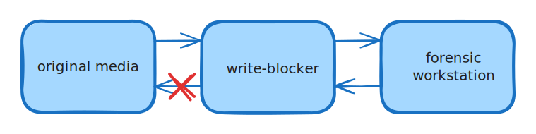

# Digital Forensic Investigation

The process of <mark style="color:blue;">**collecting**</mark>, <mark style="color:blue;">**securing**</mark>, and <mark style="color:blue;">**transporting**</mark> digital evidence <mark style="color:blue;">should not change the evidence</mark>

Digital evidence should only be <mark style="color:blue;">examined by those trained</mark> specifically for that purpose.

Everything done during the seizure, transportation, and storage of digital evidence should be fully <mark style="color:blue;">**documented**</mark>, <mark style="color:blue;">**preserved**</mark>, and <mark style="color:blue;">**available for review.**</mark>

### <mark style="color:blue;">Before the Crime Scene</mark>

* Scope of <mark style="color:blue;">warrant</mark> and its <mark style="color:blue;">validity</mark>
* Forensic paraphernalia&#x20;
* Computer tools kit

***

### <mark style="color:blue;">At  the Crime Scene</mark>

* <mark style="color:blue;">**Recognise**</mark>, <mark style="color:blue;">**Identify**</mark>, <mark style="color:blue;">**Seize**</mark>, and <mark style="color:blue;">**Secure**</mark> all digital evidence at the scene
* <mark style="color:blue;">Document</mark> the entire scene and <mark style="color:blue;">specific location</mark> of the evidence found
* <mark style="color:blue;">Collect</mark>, <mark style="color:blue;">label,</mark> and <mark style="color:blue;">preserve</mark> the digital evidence
* Package and transport digital evidence in a secure manner
* Before seizing an item:
  * any interference should be designed carefully to meet the <mark style="color:blue;">necessity</mark> and _<mark style="color:blue;">proportionality</mark>_ objectives; it should not be arbitrary or unfair
*   <mark style="color:blue;">**Proportionality issues:**</mark>

    * consider whether the item is _<mark style="color:blue;">likely to hold evidence</mark>_
    * ensure that details of where the item was found are _<mark style="color:blue;">recorded</mark>_
    * consider _<mark style="color:blue;">when</mark>_ the offence was committed
    * differentiate between mobile phones found on a suspect and phones found in a drawer

<mark style="color:blue;">**ISO 27037**</mark>

* The investigator in charge needs to decide <mark style="color:blue;">whether or not to seize the evidence</mark>; whether to do <mark style="color:blue;">live or partial acquisition</mark>
* The investigator needs to balance the _circumstances, cost, time, available resources_ and _priorities_
* The investigator needs to consider <mark style="color:blue;">risk of liability</mark> for _unnecessary disruption_ of business and/or potential violation of human rights
* The investigator needs to consider the <mark style="color:blue;">likelihood of destruction of potential digital evidence</mark>

#### Reasons for live acquisition:

* when <mark style="color:blue;">volatile data</mark> is relevant for the investigation&#x20;
* when <mark style="color:blue;">full disk encryption/encrypted volumes</mark> are suspected
* when the <mark style="color:blue;">system is too critical to be powered off</mark>
* when <mark style="color:blue;">malware</mark> is suspected
* when <mark style="color:blue;">data in transit contains potential evidence</mark>

#### Shutdown decisions

* <mark style="color:blue;">**Graceful shutdown**</mark>
  * The computer is shutdown by software
  * The <mark style="color:blue;">OS is allowed to end processes</mark> and connections before shutdown
* <mark style="color:blue;">**Hard shutdown**</mark>
  * When the <mark style="color:blue;">electric power is interrupted</mark> or the power off button is used to turn off the computer
  * This <mark style="color:blue;">preserves better the original state</mark> or processes and <mark style="color:blue;">causes less changes</mark>; ACPO Principle 1

***

### <mark style="color:blue;">After the Crime Scene</mark>

#### Preparation

* Creating a <mark style="color:blue;">plan of action.</mark>
* Developing a strategy for handling a type of investigation (training etc)
* Obtaining necessary resources (personnel, hardware, software etc)

#### Survey / Identification

* <mark style="color:blue;">Finding</mark> and <mark style="color:blue;">recognising</mark> all potential sources of _evidence relevant to the case_
* Making <mark style="color:blue;">informed</mark> and <mark style="color:blue;">reasoned decisions</mark> about what digital evidence to <mark style="color:blue;">**acquire in which order;**</mark> prioritisation

#### Preservation / Acquisition

* Following [ACPO guidelines](best-practises-and-admissibility.md#acpo-guidelines) for handling digital evidence
* <mark style="color:blue;">Cataloguing</mark> and storing the original evidence seized in a controlled way and location
* Keeping the <mark style="color:blue;">chain of custody</mark> up-to-date
* Making <mark style="color:blue;">exact digital duplicates</mark> of the original evidence to be examined / analysed by investigators (_bit-by-bit copies; image files .dd_)
* Using a write-blocker device is the best practise to prevent the original media from changing during acquisition.
* Preventing alterations / changes&#x20;

#### Examination&#x20;

* <mark style="color:blue;">Extracting</mark> and viewing information from the evidence to <mark style="color:blue;">prepare it for analysis</mark>
* Making it available for analysis which involves...
  * <mark style="color:blue;">**Recovery:**</mark>
    * Of _deleted / hidden / camouflaged files_
    * _Reconstruction_ of data fragments to recover files
  * <mark style="color:blue;">**Harvesting:**</mark>
    * _Gathering data_ and metadata about all recovered files
  * <mark style="color:blue;">**Organisation and Search**</mark>
    * _Grouping_ / tagging / bookmarking / searching
    * _Physically organising_ data into meaningful units to facilitate access
  * <mark style="color:blue;">**Reduction:**</mark>
    * Eliminating irrelevant data

#### Analysis

* Analysing content and <mark style="color:blue;">putting information into context</mark>
* <mark style="color:blue;">Aggregating</mark> and <mark style="color:blue;">correlating information</mark> to <mark style="color:blue;">reconstruct events</mark> and determine the offenders _modus operandi_, timeline of events, motivation, opportunity etc
* <mark style="color:blue;">Explaining provenance of evidence;</mark> question how
* <mark style="color:blue;">Validated facts</mark> and <mark style="color:blue;">reasoned finding</mark> around a theory which **explains the crime** / offence with a degree of certainty&#x20;

#### Presentation

* <mark style="color:blue;">Documenting processes</mark>, <mark style="color:blue;">methods</mark> and <mark style="color:blue;">tools</mark> used to <mark style="color:blue;">**seize**</mark>, <mark style="color:blue;">**collect**</mark>, <mark style="color:blue;">**preserve**</mark>, <mark style="color:blue;">**recover**</mark>, <mark style="color:blue;">**reconstruct**</mark>, <mark style="color:blue;">**organise**</mark>, and <mark style="color:blue;">**search key evidence**</mark>
* Generating reports
  * <mark style="color:blue;">Documenting each conclusion</mark> with thorough description of <mark style="color:blue;">supporting evidence and analysis</mark>
  * Documenting any _alternative theories eliminated_ because they were contradicted or unsupported by evidence
  * <mark style="color:blue;">Translating technical details</mark> into narrative for non-technical decision makers

